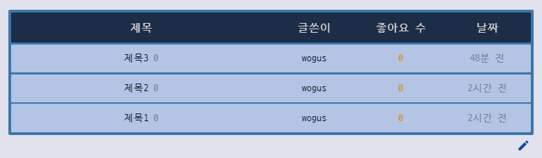

# 1. Meeting Log

## # CommnunityView Backend 연동 (박재현)

## 결과 사진

#### 주요 기능

* pagination
  * 1페이지당 10개의 게시물을 출력, 가장 최근의 게시물이 보이도록 하였다.
* 생성 시간 표시
  * 1일이 지나갔을 경우 년,월,일을 출력
  * 24시간 내에 작성시, ~시간 전 출력
  * 1시간 이내에 작성시, ~분 전 출력
  * 1분 이내에 작성시, 방금 전 출력
* 하단 글 작성 버튼 글 작성 페이지와의 연동

## #ArticleDetailView Backend 연동 (박재현)

### 결과 사진

### 구현된 주요 기능

* 작성된 글 삭제하기
* 사용자가 좋아요 했을 시, 상세 페이지에서 보이는 하트가 빨간색, 안 했을 시, 회색으로 보이게 하기
* 댓글 작성
* 작성한 사용자가 댓글 삭제 가능

## #프로필, 팔로우, 나의 영화 리스트 (이원우) -----

- postman을 활용해 프로필 페이지, 유저 팔로우, 유저 팔로잉, 팔로우한 영화 리스트 serializer 정보 서버 구축 완료
- 프로필 페이지 와이어프레임 완성

- 생각보다 와이어 프레임으로 작성했던 디자인이 모바일에 최적화된 비율이라서 수정했습니다.

## 게시글 작성 / 프로필(Django)

- 유저가 좋아하는 영화 정보와 프론트에서 요청을 받는 페어와의 소통을 통해 넘겨줄 자료 정제
- 댓글 정보 및 게시글을 좋아한 유저 정보 필드 추가 재정의 및 응답
- 프로필 페이지 추가 정보 및 팔로잉 팔로우 기능 필드 추가 및 검증

### #문제해결

- 회원가입 페이지에서 `대상 컴퓨터에서 연결을 거부했습니다` 문제 해결
- 같은 serializer 클래스에서 역참조 값을 받아야하는 상황이 있었는데 N:M 관계를 형성한 반대 필드에서 정의해 요청을 보냄으로써 해결.

### # 향후 과제

* accounts에 작성한 article관련 메서드들 articles로 옮기기
* 상세 페이지에서 글 수정 페이지로 이동하는것 하기
* 글 작성 및 글 수정 페이지 만들기

### 프로젝트 작업 백로그 & 개선 사항

* 게시판 글 작성/편집 페이지
* 게시판 작성자 클릭 프로필 링크 / 동그란 작은 이미지크기
* 프로필 페이지 데이터 받아지는지
* 회원 정보 수정 페이지
* 네비게이션 바 / 뒤로가기 버튼 등
* 뒤로가기 등 라우터 버튼
* 리뷰 기능 / 추가 삭제 / 베스트 리뷰 3개 맨 위에 띄우기
* 디테일 페이지 영화 배우 정보 등 / 영화 좋아요 누르면 프로필에 영화 카드 저장
* 검색 기능 구현
* 유튜브 기능
* 404 페이지
* 소셜 로그인
* 최초 화면 애니메이션
