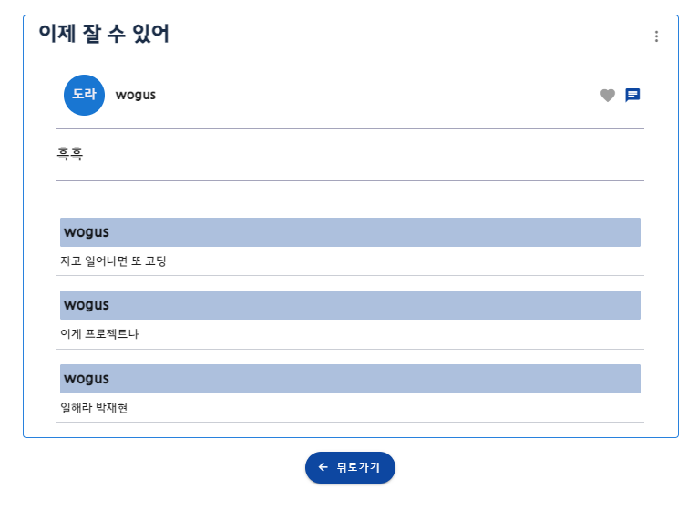
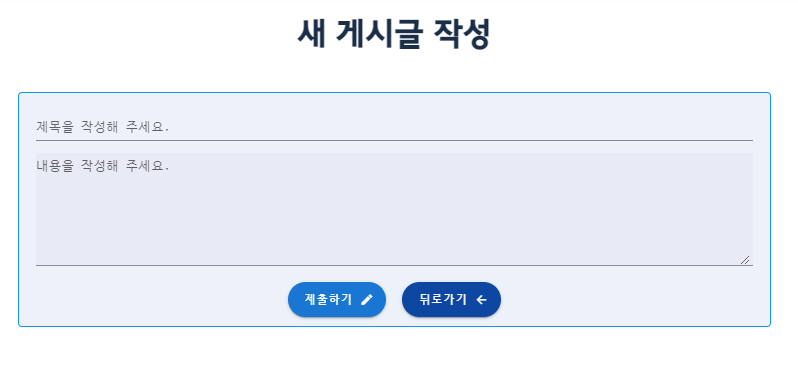
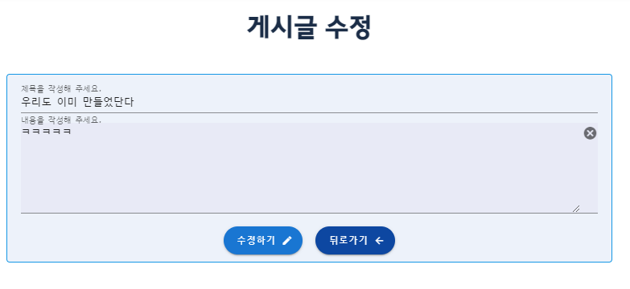

# 1. Meeting Log

### # 게시판 이동시 댓글 작성자 이름을 받아 올 수 없는 문제(박재현)

> 문제 상황
>
> - 게시판 이동시, Detail 페이지에서 게시글 댓글 content는 정상 출력 되지만, 사용자 이름은 출력 되지 않는 문제가 발생하였다.
> - 확인한 결과, 게시판 -> Detail 이동시에 받아오는 article.comments에서는 user가 pk 값을 받아오지만 게시글 내에 댓글 작성 후 갱신되는 comments 정보는 user가 pk,username Object 형태로 갱신되어 정상 출력되었다.

* 게시판 -> Detail 이동시 받아오는 article.comments 정보

* 댓글 생성후 갱신된 article.comments 정보

#### #해결 과정

* 게시판 -> Detail 이동시 받아오는 article.comments 정보는 comment 모델필드의 값을 가져오고, 갱신되는 article.comments 정보는 새로 재정의된 값을 가져왔다.

  

* 따라서 기존 게시판 -> Detail 이동시 받아오는 article.comments 정보를 새롭게 재정의하여 해결하였다.

  

## 기능 구현(이원우)

- 프로필 팔로우, 언팔로우 및 데이터 확인 / 팔로우, 팔로잉 갱신 확인
- 개별 좋아하는 영화 담기 기능 완료 (문제점 발생: 팔로우가 되었는지 다시 들어가면 갱신이 되지 않음.)
- 프로필 이미지 데이터베이스 저장 및 출력
- 영화 디테일 다이얼로그와 개별 영화 컴포넌트 및 데이터 연결 완료
- 좋아하는 영화 목록 프로필 페이지에 띄우기 성공
### # 게시판 뒤로가기 기능 및 UI 수정(박재현)

#### 결과 사진

* 게시판

* 상세 페이지

  

#### 주요 내용

* 폰트 추가 및 뒤로 가기 버튼 추가

### # 게시판 글 작성, 수정 페이지 UI 개선(박재현)

#### 결과 사진

### # 영화 Review Model 및 Serializer 작성(박재현)

* 영화 Detail페이지에서 리뷰 작성 및 열람을 위한 Model 생성과 요청을 위한 Serializer를 작성하였다.

  

  #### 주요 기능

  * 각 영화에 대하여 리뷰를 작성, 리뷰 삭제 가능
  * 각 리뷰에 대하여 좋아요 가능
  * Movie Detail 요청시 리뷰 목록 및 리뷰 정보 포함된 정보 송신

  

### # 향후 과제

* 상세 페이지에서 글 수정 페이지로 이동하는것 하기
* 글 작성 및 글 수정 페이지 만들기

